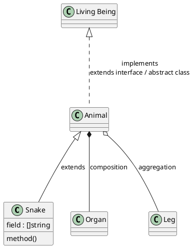
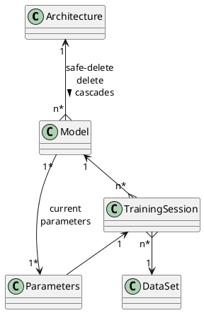

# PlantUML

## Classes

```puml
@startuml
class Snake {
    field : []string
    method()
}
"Living Being" <|... Animal : " implements \nextends interface / abstract class"
Animal <|--- Snake : extends
Animal *--- Organ : composition
Animal o--- Leg : aggregation

@enduml
```

## DB

```puml
@startuml
Architecture "1" <--{ "n*" Model : safe-delete\ndelete\ncascades >
Model "1*" --> "1*" Parameters : current\nparameters
Model "1" <--{ "n*" TrainingSession
TrainingSession "1" <-- Parameters
TrainingSession "n*" }--> "1" DataSet
@enduml
```
