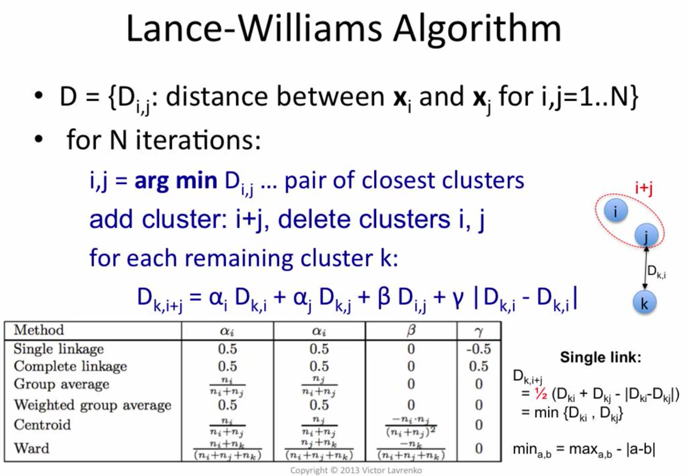

# + Cluster Analysis
- good playlist (VL): https://www.youtube.com/playlist?list=PLBv09BD7ez_6lYVoZ1RzVcOPIT5Lfjo0Y

- Leland McInnes, John Healy | Clustering: A Guide for the Perplexed:
  - https://www.youtube.com/watch?v=ayZQj4llUSU

- Clustering lecture from Stanford CS246: http://web.stanford.edu/class/cs246/ (use web links, or local ones below)
  - [slides (pdf)](./stanford-cs-246/05-clustering.pdf)
  - [lecture notes - ch7 (pdf)](./stanford-big-data-ch7.pdf)

- https://scikit-learn.org/stable/modules/clustering.html

# Uses
- discover classes in unsipervised manner
- dimensionality reduction
  - clusters = "latent factors"
  - replace some attributes with cluster numbers
  - add cluster numbers as extra attributes
  - eg. forusage in LR or SVM
- in computer vision:
  - object recognition
    - K-means on image regions
      - compute features for each region
        - eg. color distribution, luminosity etc.
      - turn picture into smth like a bag-of-words
    - clustering for image segmentation
      - compute for each point a bunch of filters
        - different sizes and orientation
        - so can "see texture"
      - add distance as another dimensition

# By Goal, Overlap, Hierarchy

### By Goal
  - monothetic
  - polythetic

### By Overlap
  - hard clustering
  - soft clustering

### By Hierarchy
  - flat
  - hierarchical
    - agglomerative (bottom-up)
    - divisive (top-down)

### Examples
  - K-D Trees
    - monothetic (mostly...)
      - bc there will be avery succinct and exact description of why every point ended in a cluster (eg. sex=M, age=20-35 ...)
    - hard
    - hierarchical
  - K-Means
    - polythetic
    - hard
    - flat
  - Gaussian mixture models (EM algorithm)
    - polythetic
    - soft
    - flat
  - Agglomerative clustering algorithms
    - pollythetic
    - hard
    - hierarchycal

# By cluster models

## Centroid models

### K-Means

- time: `O(#iterations * #clusters * #instances * #dimensions)`
  - sometimes noted `O(K N d)` ignoring number of iterations....

- minimizes aggregate intra-cluster distance (variance inside the group if distance is euclidean)
- converges to local minimum
  - so needs to be run several times with random starting points
    - pick clustering with smallest aggregate distance

- **needs user to pick K** (or "automate elbow/J method)
  - bc. otherwise aggregate distance keeps decreasing and reaches minimum when K = N
  - smth. like Minimum Description Length willl give varying values of "optimal" K depending on vector encoding method

Resouces:
- Victor Lavrenko (REALLY good): https://www.youtube.com/watch?v=_aWzGGNrcic
- Udacity / Georgia Tech:
  - https://www.youtube.com/watch?v=f4jvifS41M4
  - properties / complexity: https://www.youtube.com/watch?v=phOJY4TrqH4

**NOTE:** Maximum number of iterations is finite (exponential) `K^N`... but in practice you'd always, set a max bound, and on almost all practical problems a few tens of iterations is enough.

```yml
# Input: K, set of points x[1]...x[n]

# Pseudocode:
- Place centroids c[1]...c[k] at random locations
  - can just pick K locations of points x
- Repeat until convergence (when cluster assignment doesn't change anymore):
  - FOR each point x[i]:
    - find nearest centroid c[j]
    - assign point x[i] to cluster j
  - FOR each cluster j = 1...K:
    - update centroid:
      - c[j] <- (mean of all points x[i] assigned to cluster j)

# Time: O(#iterations * #clusters * #instances * #dimensions)
#       O(I K N d)
```

### K-medoids
- https://en.wikipedia.org/wiki/K-medoids

Chooses data points as centers - *so could maybe be usable with categorical data too?*

## Distribution models

### Gaussian Mixture Models

- Good videos (VL): https://www.youtube.com/playlist?list=PLBv09BD7ez_7beI0_fuE96lSbsr_8K8YD
- Udacity / Georgia Tech: https://www.youtube.com/watch?v=QQJHsKfNqG8

- "like K-means but probabilistic/soft"
- has some "more objective" ways of picking K:
  - pick "simplest" of models that fit - Occam's razor
    - Bayesian Information Criterion (BIC)
    - Akaike Information Criterion (AIC)

## Density models

### DBSCAN
- https://en.wikipedia.org/wiki/DBSCAN

- time:
  - `O(n log(n))` average / well behaved data
  - `O(n^2)` worse

## Connectivity-based clustering - Hierarchical clustering
- https://en.wikipedia.org/wiki/Cluster_analysis#Connectivity-based_clustering_(hierarchical_clustering)
> Connectivity-based clustering, also known as hierarchical clustering, is based on the core idea of objects being more related to nearby objects than to objects farther away.
- https://en.wikipedia.org/wiki/Hierarchical_clustering

Good video explanation playlist (VL):
- https://www.youtube.com/playlist?list=PLBv09BD7ez_7qIbBhyQDr-LAKWUeycZtx

**Two broad ways to do hierarchical clustering:**
1. Top-down - eg. hierarchical-K-means
2. Bottom-up - eg. agglomerative clustering

### Agglomerative clustering in general
- time: `O( N^2 d + N^3 )` - first build a distance matrix, then traverse it / run algoritm

```yml
- Start with a collection C of singleton clusters:
  - each clluster contains one data point:
    - c[i] = { x[i] }
- Repeat until only one cluster is left (so N times max):
  - Find pair of clusters (c[i], c[j]) that is closest (~ O(N^2) ):
    - definition of "closest" (distance metric over clusters) defines the actual algorithm in this class
    - merge clusters c[i], c[j] into a new cluster c[(i, j)]
    - remove c[i], c[j] from C, add c[(i, j)]
- Produces a dendrogram (tree of clusters)
```

**User must pick:**
- a distance function
  - popular: euclidian
    - downside: only works with numeric data
- linkage criterion

**Types of agglomerative (bottom-up) clustering** (defined by inter-cluster distance / linkage criterion):
- AWESOME introduction to all and comparison here:
  - https://www.youtube.com/watch?v=VMyXc3SiEqs&list=PLBv09BD7ez_7qIbBhyQDr-LAKWUeycZtx&index=3
- can work with non-numeric features (if you ofc provide an adequate distance function instead of the default euclidean)
  - Single-linkage clustering
    - pick distance between closest two points in different clusters
    - https://en.wikipedia.org/wiki/Single-linkage_clustering
  - Complete-linkage clustering
    - pick distance between farthest two points in different clusters
    - https://en.wikipedia.org/wiki/Complete-linkage_clustering
  - Average-linkage clustering
    - pick the average of the distance between all points in clusters
    - UPGMA (Unweighted Pair Group Method with Arithmetic Mean)
      - https://en.wikipedia.org/wiki/UPGMA
    - WPGMA (Weighted Pair Group Method with Arithmetic Mean)
      - https://en.wikipedia.org/wiki/WPGMA
- only work with numeric features:
  - Centroid linkage clustering, or UPGMC
  - Ward's method
    - ~ Minimum energy clustering
      - https://en.wikipedia.org/wiki/Energy_distance

### Lance-Williams Algorithm

General way to implement multiple agglomerative hierarchical clusterings.



It helps stay at an `O(n^3)` complexity, *while naive implementations can easily get to much worse complexities.*


## Affinity Propagation
- https://scikit-learn.org/stable/modules/clustering.html#affinity-propagation
- https://en.wikipedia.org/wiki/Affinity_propagation
- https://www.ritchievink.com/blog/2018/05/18/algorithm-breakdown-affinity-propagation/

# Metrics

## Silhouette
- https://en.wikipedia.org/wiki/Silhouette_(clustering)

# Spectral Clustering
- https://en.wikipedia.org/wiki/Spectral_clustering
