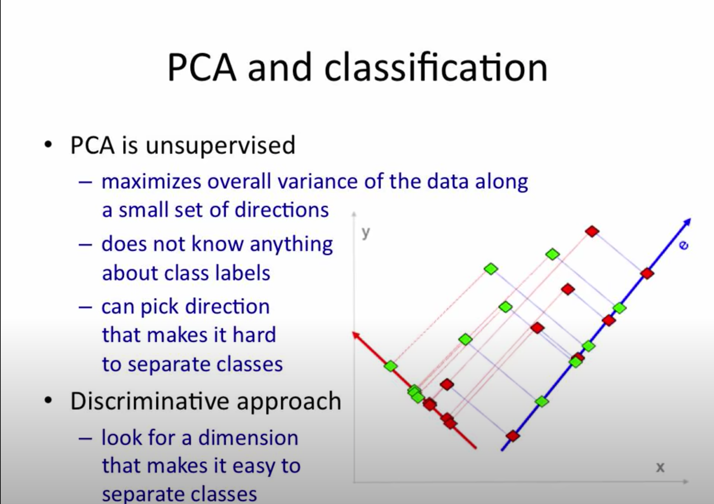

# + Dimensionality Reduction

- https://en.wikipedia.org/wiki/Dimensionality_reduction

- good lecture (VL): https://www.youtube.com/playlist?list=PLBv09BD7ez_5_yapAg86Od6JeeypkS4YM

- A Bluffer's Guide to Dimension Reduction - Leland McInnes:
  - https://www.youtube.com/watch?v=9iol3Lk6kyU

- Dimensionality reduction lecture from Stanford CS246: http://web.stanford.edu/class/cs246/ (use web links, or local ones below)
  - [slides (pdf)](./stanford-cs-246/06-dim_red.pdf)
  - [lecture notes - ch7 (pdf)](./ch11.pdf)
  - playlists:
    - 2018: https://www.youtube.com/playlist?list=PLLssT5z_DsK9JDLcT8T62VtzwyW9LNepV
    - 2016(maybe the same?): https://www.youtube.com/playlist?list=PLkWzaBlA7utLZOLxWUM5DSOslBq5JFKm8
  - vids on DR (from L46 on):
    - https://www.youtube.com/watch?v=yLdOS6xyM_Q&list=PLLssT5z_DsK9JDLcT8T62VtzwyW9LNepV&index=47&t=0s

- Udacity Computer Vision: https://www.youtube.com/watch?v=3uxOyk-SczU

- scikit-learn
  - dcomposition:
    - https://scikit-learn.org/stable/modules/decomposition.html
  - unsipervised dimensionality reduction:
    - https://scikit-learn.org/stable/modules/unsupervised_reduction.html

# Why high dimensionality is a problem:
- "the curse of dimensionality"
- points in spaces with too many dimensions are too spaced out, too many regions of empty space
- statistical methods need multiple points/observation similar in some way (close together)

- Udacity / Georgia Tech (UDMLND):
  - curse of dimensionality: https://www.youtube.com/watch?v=QZ0DtNFdDko

# Ways of dealing with high dimensionality

1. **Use domain knowledge**
  - feature engineering: SIFT, MFCC

2. **Make assumption about dimensions**
  - independence: count along each dimension separately
  - smoothness: propagate class counts to neighboring regions
  - simmetry: eg. invariance or order of dimensions

3. **Reduce the dimensionality of the data**
  - *Goal:* represent instances with fewer variabless
    - try to preserve as much structure as possible
    - discriminative: only structure that affects class separability
  - *Methods:*
    - **Feature Selection** - simplest
      - throw away some of the attributes
      - eg. pick attributes using Information Gain
    - **Feature Extraction**
      - construct a new set of dimensions that are (linear) combinations of the original ones - eg. PCA

# PCA
- time : ~ cubic

- it's basically [Singular value Decomposition - SVD](https://en.wikipedia.org/wiki/Singular_value_decomposition) applied on the **covariance matrix**
  - and SVD is a more generalized case of [eigenvalue decomposition](https://en.wikipedia.org/wiki/Eigendecomposition_of_a_matrix)
    - https://en.wikipedia.org/wiki/Singular_value_decomposition#Relation_to_eigenvalue_decomposition

- Udacity / Georgia Tech
  - p1: https://www.youtube.com/watch?v=kw9R0nD69OU
  - p2: https://www.youtube.com/watch?v=_nZUhV-qhZA
  - p3: https://www.youtube.com/watch?v=kuzJJgPBrqc

- good lecture (VL): https://www.youtube.com/playlist?list=PLBv09BD7ez_5_yapAg86Od6JeeypkS4YM

```yml
- Center data at zero: x[i, a] <- x[i, a] - m
- Compute covariance matrix ∑

# Intuition:
- Multiplying a vector by ∑ turns it to the direction of most variance
  - angle converges
  - sense varies +/-
- Want vectors 3 which aren't turned: ∑ e = l e
  - e: eigenvectors of ∑
  - l: eigenvalues

# Method:
- Find eigenvalues by solving for l:
  - det(∑ - l I) = 0
    - polynomial eqn. with multiple solutions l[i]
- Find eigenvectors by solving for each e[i] using l[i]:
  - ∑ e[i] = l[i] e[i]
    - linear system with e[i] solution
      - but eqns. are redundant, so you get only eg.:
        - e[i][1,1] = k[i] e[i][1,2]
        - choose unit-length e[i]
```

### Issues

- covariance extremely sensitive to large values
  - easily messed by eg. multiplying one dimension by 1000
    - **solution**: not just center but normalize to unit variance too
      - x' <- (x - mean) / stdev

- assumens underlying subspace is linear

- doesn't see classes (LDA can solve this)



# Linear Discriminant Analysis (LDA)
- ~ like PCA but takes advantage of class labels
  - https://www.youtube.com/watch?v=6Ht-nIf_NKc&list=PLBv09BD7ez_5_yapAg86Od6JeeypkS4YM&index=11

- **NOT always better than PCA!** - eg. on datasets where groups differ more in terms of variance than means

# NMF

`...`

# ICA

**NOT** generally used for dimensionality reduction, but for *separating multiple independent signals from one mixed signal*.

# t-SNE (t-Distributed Stochastic Neighbor Embedding)
**IMPORTANT:** practically one can only use it for visualization or similar tasks - you can't project a new point on the found dimensions, it requires re-training.

- https://en.wikipedia.org/wiki/T-distributed_stochastic_neighbor_embedding

- scikit-learn: https://scikit-learn.org/stable/modules/generated/sklearn.manifold.TSNE.html

- https://lvdmaaten.github.io/tsne/

- https://towardsdatascience.com/an-introduction-to-t-sne-with-python-example-5a3a293108d1

- https://distill.pub/2016/misread-tsne/

- Google Tech Talk - Visualizing Data Using t-SNE:
  - https://www.youtube.com/watch?v=RJVL80Gg3lA

- non-linear

# UMAP
Can be used to project new data too, just like PCA.

- t-SNE vs. UMAP (video): https://www.youtube.com/watch?v=4NlvatkpV3s

- broad and deep Enthought presentation on UMAP and more:
  - https://www.youtube.com/watch?v=nq6iPZVUxZU

# Autoencoders

- https://en.wikipedia.org/wiki/Autoencoder

- non-linear if deep NN
